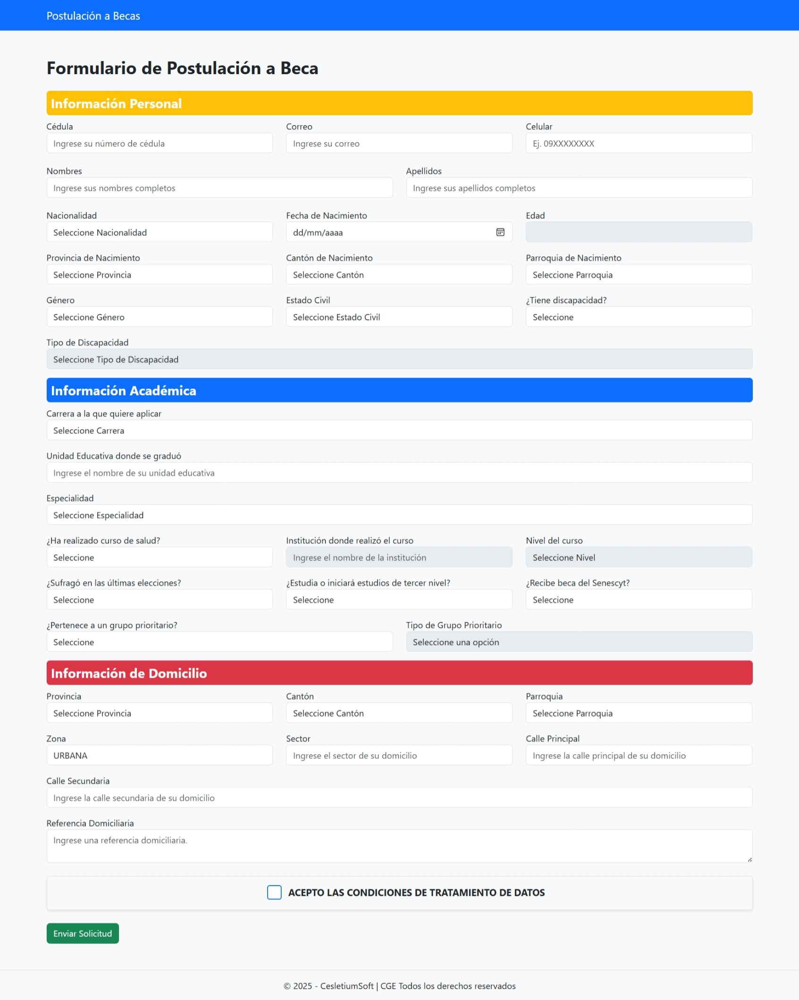

# 📝 Formulario de Postulación a Becas



Un sistema de formulario web dinámico, seguro y responsivo, diseñado para gestionar postulaciones a becas de manera eficiente. El proyecto está construido con tecnologías modernas, enfocado en ofrecer una experiencia de usuario fluida y validaciones de datos robustas tanto en el cliente como en el servidor.

---

## ✨ Tecnologías Utilizadas

Este proyecto fue construido utilizando un stack de tecnologías web moderno y confiable:

<p align="center">
  <a href="https://www.php.net/" target="_blank">
    
  </a>
  <a href="https://www.mysql.com/" target="_blank">
    
  </a>
  <a href="https://developer.mozilla.org/es/docs/Web/JavaScript" target="_blank">
    
  </a>
  <a href="https://getbootstrap.com/" target="_blank">
    
  </a>
  <a href="https://developer.mozilla.org/es/docs/Web/Guide/HTML/HTML5" target="_blank">
    
  </a>
  <a href="https://developer.mozilla.org/es/docs/Web/CSS" target="_blank">
    
  </a>
</p>

---

## 🚀 Características Principales

El sistema cuenta con múltiples funcionalidades diseñadas para mejorar la usabilidad y la integridad de los datos:

* **Validación en Tiempo Real:**
    * ✅ **Cédula Ecuatoriana:** Algoritmo de validación del dígito verificador implementado en JavaScript.
    * ✅ **Campos Dinámicos:** Validación instantánea para correo, celular, nombres y apellidos.
* **Interfaz Dinámica e Interactiva:**
    * 🌎 **Selects Dependientes:** Carga de Cantones y Parroquias basada en la Provincia seleccionada, utilizando AJAX sin recargar la página.
    * 👓 **Campos Condicionales:** Habilitación/deshabilitación automática de campos según la selección del usuario (ej. Discapacidad, Cursos, Grupo Prioritario).
* **Experiencia de Usuario Mejorada:**
    * ⚡ **Envío Asíncrono (AJAX):** El formulario se envía sin recargar la página, mostrando mensajes de éxito o error de forma instantánea.
    * 🎨 **Diseño Responsivo:** Interfaz adaptable a cualquier dispositivo (móvil, tablet, escritorio) gracias a **Bootstrap 5**.
    * ✒️ **Autocompletado y Formato:** Cálculo automático de la edad y conversión a mayúsculas en campos de texto relevantes.
* **Seguridad del Lado del Servidor:**
    * 🔒 **Consultas Preparadas:** Interacción segura con la base de datos para prevenir inyecciones SQL.
    * 🛡️ **Validación Backend:** Todos los datos críticos (cédula, email, etc.) son validados nuevamente en el servidor antes de ser guardados.

---

## 🛠️ Instalación y Puesta en Marcha

Para ejecutar este proyecto en tu entorno local, sigue estos sencillos pasos:

1.  **Requisitos Previos:**
    * Tener instalado un entorno de desarrollo local como **XAMPP**, WAMP o MAMP.
    * Acceso a un gestor de base de datos como **phpMyAdmin**.

2.  **Clonar el Repositorio (o copiar los archivos):**
    ```bash
    # Si usas Git
    git clone [https://tu-repositorio.com/formularioBecas.git](https://tu-repositorio.com/formularioBecas.git)
    
    # O simplemente copia la carpeta 'formularioBecas' en tu directorio htdocs
    # Por ejemplo: C:\xampp\htdocs\
    ```

3.  **Configurar la Base de Datos:**
    * Abre **phpMyAdmin** desde tu panel de XAMPP.
    * Crea una nueva base de datos llamada `becas`.
    * Importa el archivo `becas.sql` (que contiene las tablas `tbl_provincia`, `tbl_canton`, `tbl_parroquia` y `solicitudes`) en la base de datos recién creada.
    * Verifica que la conexión en `config/db.php` coincida con tus credenciales de MySQL (por defecto para XAMPP son correctas).

4.  **Ejecutar el Proyecto:**
    * Abre tu navegador web y ve a `http://localhost/formularioBecas/`
    * ¡Listo! El formulario de postulación debería estar funcionando.

---

## 📂 Estructura del Proyecto

El proyecto está organizado de una manera clara y modular para facilitar su mantenimiento y escalabilidad.

```
/formularioBecas
│
├── 📂 ajax/
│   ├── get_cantones.php      # (Backend) Obtiene los cantones vía AJAX
│   └── get_parroquias.php    # (Backend) Obtiene las parroquias vía AJAX
│
├── 📂 assets/
│   └── 📂 js/
│       ├── dynamic-select.js # Lógica para los selects dependientes
│       └── formularioBecas.js # Lógica de validación y AJAX del formulario
│
├── 📂 config/
│   └── db.php                # Configuración de la conexión a la BD
│
├── 📂 includes/
│   ├── header.php            # Cabecera HTML, estilos y navbar
│   └── footer.php            # Pie de página y scripts JS
│
├── index.php                 # Página principal con el formulario HTML
└── submit.php                # (Backend) Procesa y guarda los datos del formulario

```

---

## 📄 Licencia

Este proyecto se distribuye bajo la Licencia MIT. Consulta el archivo `LICENSE` para más detalles.

---

## 👨‍💻 Autor

Desarrollado con ❤️ por **Jordan Espinosa| CelestiumSoft**.

<p align="center">
  <em>&copy; <?php echo date("Y"); ?> - Todos los derechos reservados</em>
</p>